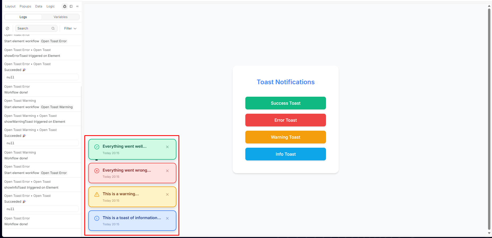
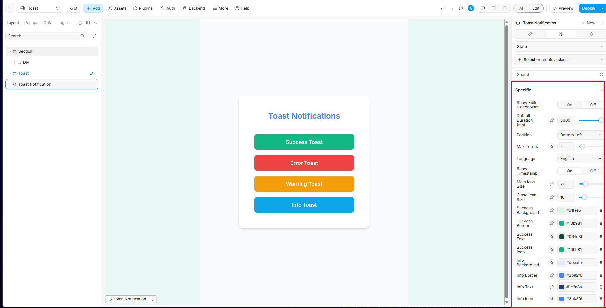
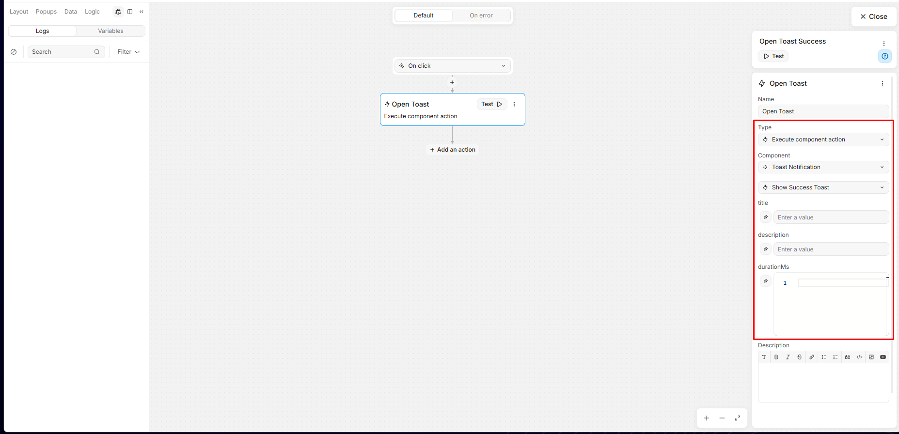
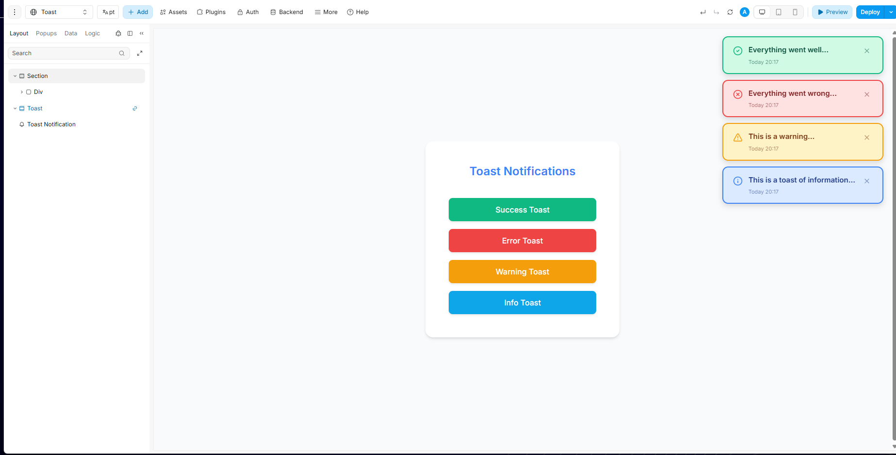

# Componente Toast Notification para WeWeb

[](https://www.weweb.io/)
[](https://vuejs.org/)
[](LICENSE)

[English](README.md) | **[Portugues]**

Um componente WeWeb reutilizavel para exibir notificacoes toast personalizadas com suporte a 4 tipos (success, info, warning, error), auto-dismiss configuravel e integracao via Workflow.



## Por Que Este Componente?

Toda aplicacao precisa de feedback: *success*, *error*, *warning*, *info*... e desenvolvedores geralmente acabam reconstruindo notificacoes toast do zero em cada projeto.

**Importe uma vez, reutilize em todo lugar.**

- Importe o componente codificado no seu projeto uma unica vez
- Configure-o em uma pagina
- Em outras paginas, basta usar **"Create an instance"** e conectar aos seus workflows
- Cada workflow envia apenas **title, description e durationMs** ao chamar a action do componente

Isso mantem a UX consistente em toda a aplicacao enquanto permite que cada pagina decida *o que* dizer.

## Funcionalidades

- 4 tipos de toast: success, info, warning, error
- Auto-dismiss configuravel (padrao: 5000ms, max: 30s)
- Posicionamento flexivel (4 posicoes no desktop)
- **Responsivo para mobile** (centralizado no topo, 90% width)
- Queue automatica com limite de toasts
- Validacao de payload com eventos de erro
- Renderizacao condicional (description opcional)
- Animacoes suaves adaptadas por dispositivo
- Integracao completa com Workflows WeWeb

**Configuravel pelo editor:**

- Duracao padrao (ms)
- Posicao (top/bottom, left/right)
- Numero maximo de toasts na tela
- Idioma + visibilidade do timestamp
- Tamanhos dos icones
- Cores para cada tipo de toast (success, error, warning, info)

## Inicio Rapido

### Desenvolvimento Local

```bash
# Instalar dependencias
npm install

# Iniciar servidor de desenvolvimento
npm run serve --port=8080
```

Depois, no WeWeb Editor:
1. Va em **Dev** > **Add local Element**
2. Nome: `toast-notification`, Porta: `8080`
3. Aceite o certificado SSL

### Uso em Producao

1. Publique este repo no GitHub
2. No WeWeb Dashboard: adicione como **Source Code**
3. No WeWeb Editor: arraste o componente para sua pagina
4. Use **Execute Component Action** nos Workflows

## Configuracao

Todas as propriedades sao configuraveis diretamente no editor WeWeb:



| Propriedade | Tipo | Padrao | Descricao |
|-------------|------|--------|-----------|
| Default Duration | Number | 5000 | Duracao em milissegundos |
| Position | Select | Bottom Left | Posicao do toast na tela |
| Max Toasts | Number | 5 | Maximo de toasts visiveis |
| Language | Select | English | Idioma para timestamps |
| Show Timestamp | Toggle | On | Exibir horario nos toasts |
| Main Icon Size | Number | 20 | Tamanho do icone do toast |
| Close Icon Size | Number | 16 | Tamanho do botao fechar |
| Success Colors | Color | Tons de verde | Background, borda, texto, icone |
| Error Colors | Color | Tons de vermelho | Background, borda, texto, icone |
| Warning Colors | Color | Tons de amarelo | Background, borda, texto, icone |
| Info Colors | Color | Tons de azul | Background, borda, texto, icone |

## Integracao com Workflow

Use **Execute Component Action** para disparar toasts de qualquer workflow:



### API do Payload

#### Campos Obrigatorios

| Campo | Tipo | Valores |
|-------|------|---------|
| `type` | String | `"success"`, `"info"`, `"warning"`, `"error"` |
| `title` | String | Qualquer string |

#### Campos Opcionais

| Campo | Tipo | Descricao |
|-------|------|-----------|
| `description` | String | Texto adicional (nao renderiza se omitido) |
| `durationMs` | Number | Duracao customizada em ms |

### Exemplo de Payload

```json
{
  "type": "success",
  "title": "Salvo com sucesso",
  "description": "Suas alteracoes foram salvas.",
  "durationMs": 5000
}
```

## Exemplos Visuais

### Todos os Tipos de Toast


### Posicao Top Right



## Estrutura do Projeto

```
toast_notification_vue/
├── src/
│   ├── wwElement.vue              # Componente host principal
│   └── components/
│       └── ToastItem.vue          # Item individual de toast
├── docs/
│   └── img/                       # Imagens da documentacao
├── ww-config.js                   # Configuracao WeWeb
├── package.json                   # Dependencias e scripts
├── README.md                      # Versao em ingles
└── README.pt-BR.md                # Este arquivo (Portugues)
```

## Scripts Disponiveis

```bash
npm run serve          # Dev server (porta padrao: 8080)
npm run build          # Build de producao
```

## Contribuindo

1. Fork o projeto
2. Crie uma branch (`git checkout -b feature/nova-feature`)
3. Commit suas mudancas (`git commit -m 'Adiciona nova feature'`)
4. Push para a branch (`git push origin feature/nova-feature`)
5. Abra um Pull Request

## Licenca

MIT

## Links Uteis

- [WeWeb Developer Docs](https://developer.weweb.io/)
- [WeWeb Component Documentation](https://docs.weweb.io/components/)
- [Execute Component Actions](https://docs.weweb.io/workflows/actions/execute-component-action.html)

---

**Desenvolvido para WeWeb** | Componente reutilizavel Vue 3 | Feito no Brasil
